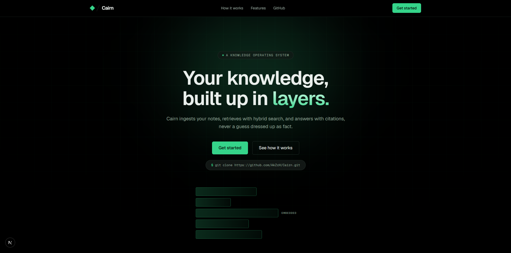

# Cairn


**A local-first, ever-evolving personal knowledge base. Ingest your notes, retrieve with hybrid search, get answers grounded in citations, not guesses.**



## Table of Contents

- [What it is](#what-it-is)
- [Key Features](#key-features)
- [Retrieval Quality](#retrieval-quality)
- [Architecture](#architecture)
- [Tech Stack](#tech-stack)
- [Quickstart](#quickstart)
- [API Reference](#api-reference)
- [Project Structure](#project-structure)
- [Development](#development)
- [Known Limitations & Roadmap](#known-limitations--roadmap)
- [License](#license)

## What it is

Cairn ingests markdown and plaintext notes, chunks them by structure rather than arbitrary character windows, embeds them locally with no GPU required, and answers questions using hybrid retrieval, full-text search fused with vector similarity, so it catches both exact terms and related concepts your notes never used the same words for. Every answer is grounded in retrieved passages with inline citations; if the notes don't cover something, Cairn says so instead of guessing.

## Key Features

**Retrieval**

- Structure-aware chunking — splits on headings, not fixed windows, so retrieved context stays coherent
- Hybrid search — Postgres full-text + pgvector cosine similarity, fused with Reciprocal Rank Fusion
- Local embeddings — BAAI/bge-small-en-v1.5, run via `candle` in Rust, CPU-only, no cloud ML calls

**Ingestion**

- Two paths: a Rust CLI for whole-folder, locally-embedded ingestion, and a web upload path (paste or drag-and-drop) with server-side embedding via `fastembed`, same model, same vector space
- Edits update, not duplicate — re-ingesting a changed file replaces its old chunks rather than forking your knowledge base
- Path-based document identity, content-hash change detection

**Product**

- Multi-tenant — real accounts, JWT auth for the web app, API keys for the CLI, data isolation verified with two separate real accounts, not assumed
- Citation-grounded, multi-turn chat — conversations persist in Postgres indefinitely, with a bounded context window sent per LLM call
- Next.js landing page and authenticated dashboard

## Retrieval Quality

Rather than claim hybrid retrieval works, it's measured. A [reproducible evaluation harness](backend/eval/) compares four retrieval strategies against a labeled question set, mean ± standard deviation over 5 runs:

| Mode                  | Recall@5        | MRR             |
| --------------------- | --------------- | --------------- |
| Full-text (AND)       | 0.00 ± 0.00     | 0.00 ± 0.00     |
| Full-text (websearch) | 0.00 ± 0.00     | 0.00 ± 0.00     |
| Vector-only           | 1.00 ± 0.00     | 0.90 ± 0.00     |
| **Hybrid**            | **1.00 ± 0.00** | **0.90 ± 0.00** |

Both full-text modes score zero because Postgres's `plainto_tsquery` and `websearch_to_tsquery` AND every query term together by default (verified against PostgreSQL's own documentation), and natural-language questions rarely share every word with the passage that answers them. Vector search closes that gap by matching on meaning, not tokens; hybrid degrades gracefully to whichever signal actually has data.

This number is real, not aspirational: building the harness surfaced and fixed two genuine bugs, a markdown parser silently collapsing bullet lists into diluted, unfocused chunks, and a missing `ORDER BY` tiebreaker causing non-deterministic results near the retrieval limit. Full methodology, dataset, and findings in [`backend/eval/README.md`](backend/eval/README.md).

## Architecture

┌─────────────┐ ┌──────────────┐ ┌─────────────────┐ ┌──────────────┐
│ ingest/ │────▶│ backend/ │◀───▶│ db/ │ │ frontend/ │
│ Rust binary │ │ FastAPI │ │ Postgres + │ │ Next.js │
│ parse+chunk │ │ auth, search,│ │ pgvector │ │ landing page │
│ +embed, │ │ chat (Groq) │ │ │ │ + dashboard │
│ HTTP upload │ │ │ │ │ │ │
└─────────────┘ └──────────────┘ └─────────────────┘ └──────────────┘

- **`ingest/`** — Rust CLI. Parses markdown/plaintext, chunks by section, embeds locally via `candle`, uploads to the backend over an authenticated API, not a direct DB connection.
- **`backend/`** — FastAPI service. Auth, hybrid retrieval, citation-grounded chat, conversation history, document upload/intake.
- **`db/`** — SQL migrations for the full schema, plus a small dependency-free migration runner.
- **`frontend/`** — Next.js landing page and authenticated dashboard.
- **`eval/`** — Reproducible retrieval evaluation harness (see [Retrieval Quality](#retrieval-quality)).
- **`infra/`** — Docker Compose wiring Postgres + backend together.

## Tech Stack

| Layer                       | Choice                                                   |
| --------------------------- | -------------------------------------------------------- |
| Ingestion & embedding       | Rust, `candle`, `pulldown-cmark`, `reqwest`              |
| Storage                     | PostgreSQL 16 + pgvector (HNSW index, cosine similarity) |
| API & auth                  | Python, FastAPI, `asyncpg`, JWT + API keys               |
| LLM                         | Groq (`openai/gpt-oss-20b`)                              |
| Query/web-upload embeddings | `fastembed` (ONNX, same model as the Rust path)          |
| Frontend                    | Next.js, Tailwind, TypeScript                            |

## Quickstart

```bash
cp infra/.env.example infra/.env
# fill in GROQ_API_KEY (console.groq.com) and a real JWT_SECRET (openssl rand -hex 32)

cd infra
docker compose up --build -d
docker compose exec backend python db/run_migrations.py
```

Sign up for an account:

```bash
curl -X POST http://localhost:8000/auth/signup \
  -H "Content-Type: application/json" \
  -d '{"email": "you@example.com", "password": "a-real-password"}'
```

Save the returned `api_key` into `ingest/.env` (see `ingest/.env.example`), download the embedding model (see `ingest/models/README.md`), then ingest a folder:

```bash
cd ingest
cargo run -- /path/to/your/notes
```

Run the frontend:

```bash
cd frontend
npm install
npm run dev
```

## API Reference

All routes except `/auth/*` and `/health` require `Authorization: Bearer <token>` (JWT for browser/dashboard use, API key for the CLI).

| Method | Path                           | Purpose                                                       |
| ------ | ------------------------------ | ------------------------------------------------------------- |
| `POST` | `/auth/signup`                 | Create an account, returns a JWT and a one-time API key       |
| `POST` | `/auth/login`                  | Returns a JWT                                                 |
| `GET`  | `/search?q=...`                | Hybrid retrieval, returns ranked chunks                       |
| `POST` | `/chat`                        | Citation-grounded answer, creates or continues a conversation |
| `GET`  | `/conversations`               | List a user's conversations                                   |
| `GET`  | `/conversations/{id}/messages` | Full message history for one conversation                     |
| `POST` | `/upload/text`                 | Paste-and-ingest raw text (server-side embedding)             |
| `POST` | `/upload/file`                 | Drag-and-drop `.md`/`.txt` upload (server-side embedding)     |
| `POST` | `/documents/upload`            | CLI intake — pre-chunked, pre-embedded content (API key only) |

Example:

```bash
curl -X POST http://localhost:8000/chat \
  -H "Authorization: Bearer $TOKEN" \
  -H "Content-Type: application/json" \
  -d '{"question": "What does my PRD say about the vector store?"}'
```

## Project Structure

Cairn/
├── ingest/ # Rust CLI — parse, chunk, embed, upload
├── backend/ # FastAPI — auth, retrieval, chat, upload
├── db/ # SQL migrations + migration runner
├── frontend/ # Next.js landing page + dashboard
├── eval/ # Retrieval evaluation harness (see backend/eval/)
└── infra/ # Docker Compose

## Development

Run the retrieval evaluation harness:

```bash
docker compose exec backend python -m eval.run_eval --email you@example.com --runs 5
```

Rust unit coverage lives alongside the parser/chunker (`ingest/src/`); run with `cargo test` from `ingest/`.

Add a schema change as a new numbered file in `db/migrations/`, then run `python db/run_migrations.py` inside the backend container, migrations are tracked and idempotent.

## Known Limitations & Roadmap

- No CI pipeline yet — the eval harness runs manually, not on push
- No hosted deployment — local Docker Compose only
- Web-upload chunking (Python) is simpler than the Rust CLI's structure-aware chunker — paragraph-based, not yet feature-parity
- Single-region, single-instance Postgres — no read replicas, no backup automation

## License

[MIT](LICENSE)
